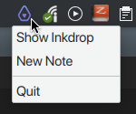

# Tray plugin for Inkdrop

[](https://github.com/jmerle/inkdrop-tray/actions?query=workflow%3ABuild)
[](https://my.inkdrop.app/plugins/tray)
[](https://my.inkdrop.app/plugins/tray)
[](https://github.com/jmerle/inkdrop-tray/blob/master/LICENSE)



This plugin shows a tray icon for Inkdrop and makes it possible to minimize Inkdrop to tray. Minimizing to tray can be disabled in the plugin's settings.

## Install

```
ipm install tray
```

## Changelog

See the [GitHub releases](https://github.com/jmerle/inkdrop-tray/releases) for an overview of what changed in each update.

## Contributing

All contributions are welcome. Please read the [Contributing Guide](https://github.com/jmerle/inkdrop-tray/blob/master/CONTRIBUTING.md) first as it contains information regarding the tools used by the project and instructions on how to set up a development environment.
